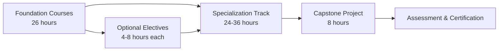

# Robot Campus Curriculum Overview

> A comprehensive robotics education program combining theoretical foundations with practical applications

## Curriculum Overview

Robot Campus delivers systematic robotics education through a structured curriculum that balances theoretical understanding with practical implementation. The program emphasizes comprehensive mastery of robotics principles, supported by hands-on projects using industry-standard tools and platforms.

**Version 2.0.0**: This curriculum has been transformed to academic textbook format, providing a rigorous foundation in robotics engineering suitable for learners seeking in-depth technical knowledge.

## Curriculum Structure

### Academic Learning Model

### Program Duration

| Track | Foundation | Specialization | Capstone | Total Hours | Theory/Practice |
|-------|------------|----------------|----------|-------------|-----------------|
| **Robotic Designer** | 26h | 24h | 8h | 58h | 60/40 |
| **Hardware Engineer** | 26h | 24h | 8h | 58h | 60/40 |
| **Software Engineer** | 26h | 28h | 8h | 62h | 70/30 |
| **AI Engineer** | 26h | 36h | 8h | 70h | 70/30 |
| **Systems Engineer** | 26h | 30h | 8h | 64h | 70/30 |

---

## Foundation Courses (All Tracks)

**Total: 26 hours**

All learners begin with foundation courses establishing essential theoretical knowledge and fundamental skills across core robotics disciplines.

### [RC-101: Robotics Fundamentals](/docs/courses/foundations/rc-101)

Duration: 4 hours | Format: Lecture with laboratory exercises

- Introduction to robotics history, evolution, and applications
- Robot architecture and component analysis
- First robotic system interaction (LED control or gripper simulation)
- Basic robot programming and behavior implementation
- **Learning Outcome**: Functional robot demonstration

### [RC-102: Mathematical Foundations for Robotics](/docs/courses/foundations/rc-102)

Duration: 6 hours | Format: Theory with computational exercises

- Linear algebra for robotics: vectors, matrices, and transformations
- Coordinate systems and reference frames
- Forward kinematics implementation
- Applied robotics mathematics and trajectory calculations
- **Learning Outcome**: Robot kinematics solver

### [RC-103: Programming for Robotics](/docs/courses/foundations/rc-103)

Duration: 6 hours | Format: Lecture with programming laboratories

- Python programming for robot control
- C++ fundamentals for real-time systems
- Version control with Git
- Debugging methodologies and development workflow
- **Learning Outcome**: Robot control program repository

### [RC-104: Physics for Robotic Systems](/docs/courses/foundations/rc-104)

Duration: 4 hours | Format: Theory with simulation exercises

- Forces, torques, and mechanical principles
- Kinematics and dynamics of robotic manipulators
- Gravity compensation and load analysis
- **Learning Outcome**: Physics-based robot arm simulation

### [RC-105: Electronics and Sensor Systems](/docs/courses/foundations/rc-105)

Duration: 4 hours | Format: Theory with circuit laboratory

- Circuit theory and electrical fundamentals
- Sensors and actuators in robotic systems
- Power systems and distribution
- **Learning Outcome**: Functional sensor circuit module

### [RC-106: Safety and Ethics in Robotics](/docs/courses/foundations/rc-106)

Duration: 2 hours | Format: Seminar

- Laboratory safety protocols and electrical safety
- Risk assessment and fail-safe design
- Ethical considerations in robotics and AI
- **Learning Outcome**: Safety protocol documentation

---

## Specialization Tracks

### Robotic Designer Track

**Total: 24 hours over 3 modules** | **Theory/Practice: 60/40**

#### Module 1: Computer-Aided Design Foundations

Duration: 10 hours

- **Computer-Aided Design Principles** (6h): FreeCAD and Fusion 360 fundamentals, parametric design methodology, robot component modeling
- **Additive Manufacturing** (4h): 3D printing theory, slicing algorithms, material properties, rapid prototyping processes

#### Module 2: Mechanical Engineering Applications

Duration: 10 hours

- **Materials Science and Mechanics** (6h): Material selection criteria, stress and strain analysis, tolerance design, durability testing methodologies
- **Advanced Parametric Design** (4h): Design automation, assembly constraints, configuration management

#### Module 3: Design Capstone Project

Duration: 4 hours

- Custom gripper design for SO-101 robotic manipulator
- Complete design-to-fabrication workflow
- Assembly integration and functional testing
- **Assessment**: Functional gripper demonstrating object manipulation

---

### Hardware Engineer Track

**Total: 24 hours over 3 modules** | **Theory/Practice: 60/40**

#### Module 1: Electronics and Control Systems

Duration: 10 hours

- **Electronics Engineering** (6h): Circuit design, PCB layout, motor driver circuits, servo control systems
- **Microcontroller Systems** (4h): Arduino, STM32, and Raspberry Pi architectures, firmware development, peripheral interfaces

#### Module 2: Sensor Integration and Power Systems

Duration: 10 hours

- **Sensor Systems** (6h): IMU integration, encoder interfacing, force sensing, real-time data acquisition and processing
- **Power Distribution and Safety** (4h): Voltage regulation, overcurrent protection, electromagnetic compatibility, grounding strategies

#### Module 3: Hardware Capstone Project

Duration: 4 hours

- Complete SO-101 robotic arm assembly
- Electrical system integration and wiring
- System calibration and validation
- **Assessment**: Calibrated robot arm responding to control commands

---

### Software Engineer Track

**Total: 28 hours over 3 modules** | **Theory/Practice: 70/30**

#### Module 1: Control Theory and Implementation

Duration: 6 hours

- Control algorithms for robotic systems
- Forward and inverse kinematics implementation
- Software architecture for robot control

#### Module 2: Robot Operating System (ROS2)

Duration: 14 hours

- **Kinematics** (6h): Mathematical foundations, kinematic solver implementation for SO-101
- **ROS2 Framework** (8h): Node architecture, communication paradigms (topics, services, actions), transform library (tf2), MoveIt2 motion planning framework

#### Module 3: Motion Planning and Capstone

Duration: 8 hours

- **Motion Planning Theory** (4h): Path planning algorithms, collision avoidance, trajectory optimization, OMPL library
- **Capstone Project** (4h): Autonomous pick-and-place system implementation
- **Assessment**: ROS2-controlled robot executing coordinated manipulation tasks

---

### AI Engineer Track

**Total: 36 hours over 4 modules** | **Theory/Practice: 70/30**

#### Module 1: Machine Learning Foundations

Duration: 8 hours

- Neural network architectures and training methodologies
- Convolutional neural networks for vision tasks
- Model training and evaluation
- **Application**: Object detection classifier

#### Module 2: Computer Vision for Robotics

Duration: 8 hours

- Image processing fundamentals with OpenCV
- Object detection and tracking algorithms
- Camera calibration and 3D reconstruction
- **Application**: Vision system for SO-101

#### Module 3: Imitation Learning with LeRobot

Duration: 12 hours

- Learning from demonstration theory
- Teleoperation and data collection
- Behavior cloning and diffusion policies
- **Application**: Robot learning manipulation tasks from demonstrations

#### Module 4: Reinforcement Learning and Capstone

Duration: 8 hours

- **Reinforcement Learning Theory** (4h): Markov decision processes, policy gradient methods, reward shaping, simulation-to-reality transfer, Isaac Lab platform
- **Capstone Project** (4h): Vision-guided autonomous manipulation system
- **Assessment**: AI-powered robot performing learned manipulation tasks

---

### Systems Engineer Track

**Total: 30 hours over 4 modules** | **Theory/Practice: 70/30**

#### Module 1: Systems Architecture and Design

Duration: 8 hours

- System design principles and methodologies
- Modular architecture and interface specifications
- Communication protocols and middleware
- ROS2 system architecture patterns

#### Module 2: Integration Engineering

Duration: 10 hours

- Hardware-software integration strategies
- Multi-component system debugging
- Calibration procedures and validation
- Real-time distributed systems

#### Module 3: Testing and Reliability

Duration: 8 hours

- Software testing methodologies (unit, integration, system)
- Continuous integration for robotics
- Fault detection and recovery mechanisms
- System monitoring and logging

#### Module 4: Deployment Capstone

Duration: 4 hours

- Production deployment procedures
- System documentation standards
- Maintenance and support protocols
- **Assessment**: Production-ready robotic system with complete documentation

---

## Optional Elective Modules

Specialized topics for advanced study:

### Application-Specific Robotics (4 hours each)
- **Human-Robot Interaction**: Gesture recognition and social robotics
- **Multi-Robot Systems**: Swarm coordination and distributed control
- **Agricultural Robotics**: Autonomous monitoring and intervention systems
- **Space Robotics**: Design for extreme environments

### Advanced Technical Topics (6-8 hours each)
- **Simultaneous Localization and Mapping (SLAM)**: Environment mapping and navigation
- **Soft Robotics**: Compliant mechanism design and control
- **Neuromorphic Computing**: Brain-inspired control architectures
- **Cloud Robotics**: Distributed intelligence and edge computing

### Professional Development (2-4 hours each)
- **Technical Communication**: Documentation and presentation skills
- **Project Management**: Development methodologies for robotics
- **Entrepreneurship**: Commercialization of robotic systems
- **Open Source Contribution**: Collaborative development practices

---

## Study Schedules

### Full-Time Study Track

<strong>Duration:</strong> 1-2 weeks total

- **Week 1**: Foundation courses (3-4 days) + Specialization start (2-3 days)
- **Week 2**: Specialization completion + Capstone project
- **Recommended for**: Intensive study periods, career transition
- **Time commitment**: 8-10 hours/day

### Part-Time Study Track

<strong>Duration:</strong> 2-4 weeks total

- **Weekday sessions**: 4 hours/session (evenings)
- **Optional weekend sessions**: 8 hours (supplementary study)
- **Recommended for**: Working professionals
- **Time commitment**: 20-25 hours/week

### Extended Part-Time Track

<strong>Duration:</strong> 6-8 weeks

- **Weekend sessions**: 8-12 hours/weekend
- **Supplementary weekday study**: Self-paced content review
- **Recommended for**: Students with limited weekday availability
- **Time commitment**: 12 hours/week

### Self-Paced Study

<strong>Duration:</strong> Flexible (1-6 months)

- Complete modules according to individual schedule
- Minimum recommended: 5 hours/week
- **Recommended for**: Maximum scheduling flexibility
- **Time commitment**: Variable

---

## Assessment and Certification

### Assessment Philosophy

Student competency is evaluated through demonstration of practical skills and theoretical understanding. Assessment focuses on learning outcomes and project deliverables rather than traditional examinations.

### Certification Levels

#### Module Completion Certificate
- **Requirement**: Complete any elective module (4-8 hours)
- **Deliverable**: Functional demonstration of learned concepts
- **Recognition**: Digital credential, portfolio documentation

#### Track Specialization Certificate
- **Requirement**: Complete full specialization track (24-36 hours)
- **Deliverable**: Capstone project demonstrating integrated skills
- **Recognition**: Official certificate, portfolio project documentation, code repository

#### Advanced Practitioner Certification
- **Requirement**: Complete 2 or more specialization tracks
- **Deliverable**: Cross-disciplinary integration project
- **Recognition**: Advanced certificate, portfolio showcase

#### Fellow Recognition
- **Requirement**: Complete 3 or more tracks plus community contribution
- **Deliverable**: Open-source contribution, educational content creation, or mentorship
- **Recognition**: Fellow designation, speaking opportunities, advanced study opportunities

---

## Pedagogical Approach

### Theory-Practice Integration
- Theoretical concepts introduced with mathematical rigor
- Practical applications reinforce theoretical understanding
- Laboratory exercises demonstrate real-world implementation
- Track-specific theory/practice ratios optimize learning outcomes

### Project-Based Learning
- Each module concludes with applied project work
- Projects utilize industry-standard platforms (SO-100/SO-101 robotic arms)
- Cumulative capstone projects integrate multiple competencies
- Portfolio development throughout curriculum

### Academic Rigor
- Comprehensive coverage of foundational mathematics and physics
- Systematic progression from fundamentals to advanced topics
- Emphasis on understanding principles rather than memorization
- Critical thinking and problem-solving emphasized

### Industry-Standard Tools
- **Hardware**: SO-100/SO-101 robotic manipulators, microcontroller platforms, sensor systems
- **Software**: ROS2, LeRobot framework, Python, C++
- **Simulation**: Gazebo, Isaac Lab
- **Development**: Git version control, Docker containerization, Linux (Ubuntu)
- **Design**: FreeCAD, Fusion 360, KiCAD

---

## Learning Pathways

### Foundational Pathway (Beginners)
1. Complete foundation courses (RC-101 through RC-106)
2. Select one specialization track based on interests
3. Complete capstone project
4. Engage with community for continued learning

### Comprehensive Pathway (Full-Stack Roboticist)
1. Foundation courses (26h)
2. Software Engineer Track (28h) - Control systems and ROS2
3. AI Engineer Track (36h) - Vision and machine learning
4. Hardware Engineer Track (24h) - Electronics and integration
5. Optional: Humanoid Robot Project (90h) - Advanced integration

### Career-Focused Pathway
1. Foundation courses (26h)
2. Select tracks aligned with career objectives:
   - Software engineering roles: Software + AI tracks
   - Hardware engineering roles: Hardware + Systems tracks
   - Mechanical design roles: Designer + Hardware tracks
3. Develop portfolio projects demonstrating competencies

---

## Technology Stack

### Hardware Platforms
- **Robotic Manipulators**: SO-100/SO-101 robotic arms
- **Microcontrollers**: Arduino, Raspberry Pi, STM32
- **Fabrication**: 3D printers, CNC equipment
- **Sensors**: Inertial measurement units, encoders, force/torque sensors, vision systems
- **Actuators**: Servo motors, stepper motors, brushless DC motors

### Software Frameworks
- **ROS2** (Robot Operating System): Industry-standard middleware
- **LeRobot**: Imitation learning and AI framework
- **Programming Languages**: Python, C++
- **Motion Planning**: MoveIt2, OMPL
- **Computer Vision**: OpenCV, PyTorch
- **Simulation**: Gazebo, Isaac Lab

### Design and Development Tools
- **CAD**: FreeCAD, Fusion 360
- **Electronics**: KiCAD
- **Manufacturing**: Cura, PrusaSlicer
- **Development**: Git/GitHub, VS Code, Docker
- **Operating System**: Linux (Ubuntu 22.04+)

---

## Getting Started

### Step 1: Review Prerequisites
Most tracks require:
- Computer literacy and basic command-line familiarity
- Mathematical foundation (algebra, trigonometry)
- Commitment to structured learning schedule

### Step 2: Select Learning Pathway
Explore specialization tracks and determine alignment with learning objectives and career goals.

### Step 3: Prepare Development Environment
- Install Ubuntu 22.04 (or WSL2 on Windows)
- Set up development tools (covered in RC-103)
- Obtain access to hardware platforms (physical or simulated)

### Step 4: Begin Foundation Courses
Start with RC-101: Robotics Fundamentals and progress systematically through foundation curriculum.

---

## Academic Standards

This curriculum (Version 2.0.0) has been designed to meet rigorous academic standards:

- **Comprehensive Theoretical Foundation**: Mathematical and physical principles underlying robotics
- **Systematic Progression**: Carefully sequenced topics building on prior knowledge
- **Balanced Pedagogy**: Theory/practice ratios optimized for each discipline (60/40 for design/hardware, 70/30 for software/AI/systems)
- **Assessment Rigor**: Demonstration of both theoretical understanding and practical competency
- **Industry Alignment**: Tools and platforms reflecting current professional practice

---

## Support and Resources

### During Study
- Instructional materials and references
- Laboratory access: robotic platforms, fabrication equipment, electronics facilities
- Software tools: Development environments, simulation platforms, cloud computing resources
- Community support: Discussion forums, study groups
- Academic support: Office hours, supplementary tutoring

### After Completion
- Alumni network and community access
- Continued learning opportunities: Advanced electives, new content
- Career resources: Portfolio hosting, professional networking
- Project showcase platform

---

## Contact Information

For curriculum inquiries: [academic@robotcampus.io](mailto:academic@robotcampus.io)

---

*Robot Campus: Comprehensive Robotics Education from Fundamentals to Advanced Applications*
